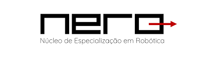

<h1 align="center">Robotics Specialization Center</h1>

  

  <b>Robotics • Autonomous Systems • Machine Learning • Artificial Intelligence</b>

---

## Robotics Specialization Center (NERo)

The **Robotics Specialization Center (NERo)** is a research laboratory at the **Federal University of Viçosa (UFV), Brazil**.

The laboratory focuses on the development of **autonomous robotic systems**, integrating control theory, perception, and embedded intelligence. Research activities emphasize **system-level design**, from mathematical modeling to experimental validation, ensuring reproducibility and engineering rigor.

---

## 🚀 Mission

* Conduct research in robotics and automation using scientifically grounded methodologies
* Train students in both theoretical and applied engineering
* Develop and validate robotic systems in real-world conditions

---

## 🔎 Research and Development

NERo conducts research in:

* Autonomous robotic systems (UGVs, UAVs)
* Control and dynamic systems
* Perception and environment interaction
* Multi-agent systems and coordination

---

## ⚙️ Projects

This organization hosts repositories related to research developed within the laboratory, including:

* Experimental robotic platforms
* Control and perception algorithms
* Research prototypes
* Supporting tools and datasets

Repositories are structured to support **reproducibility, documentation, and reuse**.
